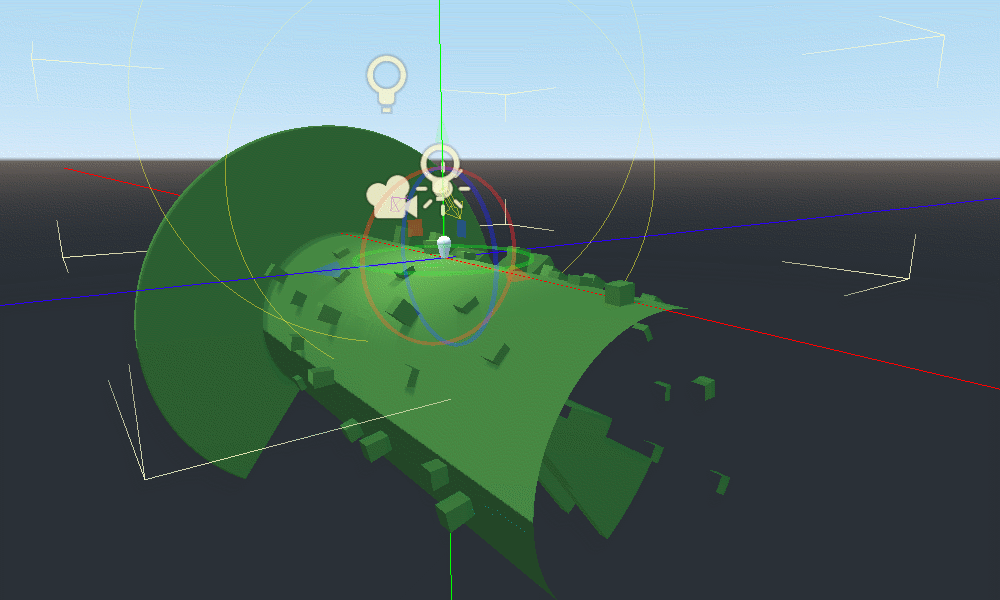

A vertex-displacement shader performing the "rolling-log" effect from Animal Crossing, written for Godot 3.1.

Press the WASD keys to move around and try it out! All the magic takes place in `rolling_log.shader`.

You can set the radius and even set it to "hang" like a towel over a rack.

Here's a screenshot of it:

And a gif of it in action:

